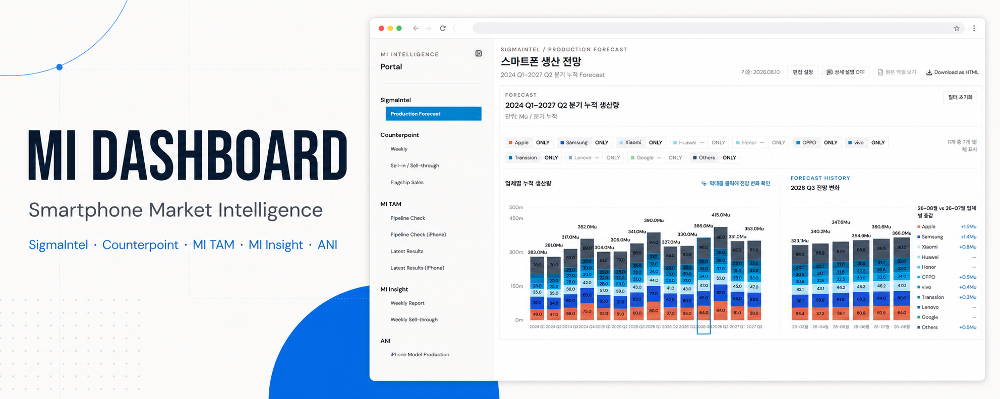

# MI Dashboard



MI Dashboard는 SigmaIntel, Counterpoint, MI TAM, MI Insight, ANI의 스마트폰 시장 리서치 화면을 한곳에서 탐색하는 로컬 데이터 허브입니다. 한 대의 Windows PC가 대시보드와 편집 API를 함께 제공하며, 같은 LAN의 사용자는 브라우저로 조회할 수 있습니다.

## 빠른 실행 — Windows

1. Python **3.10 이상**을 설치합니다. `scripts/serve_dashboard.py`가 `str | None` 문법을 사용합니다.
2. 저장소 루트의 `대시보드 실행.bat`를 더블클릭합니다.
3. 브라우저에서 [http://localhost:8000](http://localhost:8000)을 엽니다.

실행 창에는 같은 LAN에서 사용할 주소도 함께 표시됩니다. Windows 방화벽이 묻는 경우 사설 네트워크 접근을 허용하세요. 실행 창을 닫거나 `Ctrl+C`를 누르면 서버가 종료됩니다. 이미 빌드된 `site/`를 여는 데는 Node.js나 인터넷 연결이 필요하지 않습니다.

## 편집 기능 최초 설정

1. 서버 PC에서 `http://localhost:8000`을 엽니다.
2. 상단 `편집 설정`을 눌러 10자 이상의 공용 비밀번호를 한 번 설정합니다.
3. 이후 편집자는 `편집 모드`에서 자기 이름과 공용 비밀번호를 입력합니다.

최초 설정과 비밀번호 변경은 서버 PC에서만 가능합니다. 편집자는 Executive Summary 작업본을 저장하고 검토 완료 후 공개할 수 있습니다. MI Insight Weekly Sell-through에서는 YoY·WoW가 아니라 지역별 `세부 내용`만 편집합니다. 변경 이력에는 입력한 이름, 시각, 변경 전후 내용이 남습니다.

편집 상태와 이력은 `runtime/editorial/`에 저장되고 Git에서는 제외됩니다. `content.json.bak`과 `history.jsonl`이 자동 복구 자료이므로 서버 백업 시 이 폴더 전체를 보관하세요. HTTP를 유지하므로 신뢰할 수 있는 사설 LAN에서만 실행해야 합니다.

## 포털 구성

| 영역 | 화면 |
| --- | --- |
| SigmaIntel | Production Forecast |
| Counterpoint | Weekly · Sell-in / Sell-through · Flagship Sales |
| MI TAM | Pipeline Check · Pipeline Check (iPhone) · Latest Results |
| MI Insight | Weekly Report · Weekly Sell-through |
| ANI | iPhone Model Production |

## 개발

```powershell
cd prototype\mi-dashboard-shadcn
npm ci
npm run dev
```

검증과 로컬 배포용 빌드는 다음 명령으로 실행합니다.

```powershell
npm test
npm run typecheck
npm run lint
npm run build
```

## `site/`와 페이지별 다운로드

저장소 루트의 `site/`는 소스가 아니라 `npm run build`가 생성하는 정적 출력물입니다. `site/index.html`과 번들 자산 외에도 `MI_SigmaIntel.html`, `MI_Weekly_2026W32.html`, `MI_TAM_Latest_Results.html` 같은 페이지별 독립 HTML 다운로드본을 함께 생성합니다. `site/` 파일을 직접 수정하지 말고 소스를 수정한 뒤 다시 빌드하세요.

## 데이터 갱신

개발 환경에서는 JSON/CSV 파일 경로나 접근 가능한 URL을 전달해 데이터를 갱신할 수 있습니다.

```powershell
cd prototype\mi-dashboard-shadcn
npm run data:update -- "<JSON 또는 CSV 경로/URL>"
npm run data:check
npm run build
```

`data:update`와 `build`는 `editorial-defaults.json`도 다시 생성합니다. 관련 데이터가 바뀐 페이지의 작업본과 공개본만 다음 편집 요청에서 새 자동 생성본·미검토·비공개 상태로 초기화됩니다.

## 데이터와 보안

같은 LAN의 사용자는 `site/`에 포함된 데이터와 페이지별 HTML을 열거나 내려받을 수 있다고 가정해야 합니다. 사내·개인정보·비공개 원본을 번들에 포함하지 말고, LAN 공개 전 데이터 범위를 확인하세요. 비공개 작업본과 자동 생성 요약은 서버 API가 인증된 편집자에게만 제공합니다.

## 관련 문서

- [프로토타입 개발 안내](prototype/mi-dashboard-shadcn/README.md)
- [차트 및 화면 디자인 규칙](DESIGN.md)
